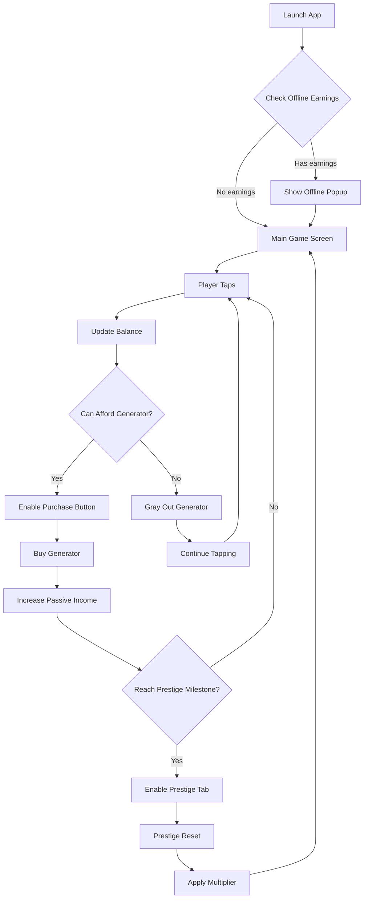

## 1. Product Overview
Tap & Earn is an addictive incremental clicker game where users tap to earn currency, unlock passive income generators, and progress through prestige cycles with escalating multipliers. The game creates an endless loop of satisfying number progression that keeps players engaged through offline earnings and exponential growth mechanics.

Target audience: Casual mobile gamers seeking quick dopamine hits and progression satisfaction. Market value lies in high retention rates through addictive gameplay loop and strategic monetization.

## 2. Core Features

### 2.1 User Roles
| Role | Registration Method | Core Permissions |
|------|---------------------|------------------|
| Player | Anonymous play (no registration) | Full game access, local progress storage |
| Premium Player | In-app purchase | Ad-free experience, bonus multipliers |

### 2.2 Feature Module
Our Tap & Earn game consists of the following main screens:
1. **Main Game Screen**: Large tap button, currency display, passive income counter, tab navigation
2. **Generators Tab**: Purchase and manage income generators with escalating costs
3. **Prestige Tab**: Reset progression for multipliers (unlocked after milestones)
4. **Settings Tab**: Game options, themes, achievement tracking

### 2.3 Page Details
| Page Name | Module Name | Feature description |
|-----------|-------------|---------------------|
| Main Game Screen | Currency Display | Show current Taps balance with large, animated numbers that update in real-time |
| Main Game Screen | Passive Income Counter | Display current income per second from all owned generators |
| Main Game Screen | Tap Button | Large central button covering 60% of screen with animated glow effect on tap |
| Main Game Screen | Tab Navigation | Bottom navigation between Generators, Prestige, and Settings tabs |
| Generators Tab | Generator List | Scrollable list of available generators with owned count, income rate, and cost |
| Generators Tab | Purchase System | Buy generators with current balance, cost scales 1.15x per purchase |
| Generators Tab | Affordability Indicator | Gray out generators player cannot afford, highlight affordable ones |
| Prestige Tab | Prestige Status | Show current multiplier, next multiplier, total taps earned |
| Prestige Tab | Prestige Button | Reset all progress for increased multiplier (visible after 1M taps milestone) |
| Prestige Tab | Warning System | Clear warning about losing all items and balance before prestige |
| Settings Tab | Theme Selection | Switch between dark, light, and neon color themes |
| Settings Tab | Achievement Display | Show unlocked achievements and progress toward next ones |
| Settings Tab | Data Management | Clear progress, export/import save data |

## 3. Core Process

### Player Flow
1. **Initial Experience**: Player taps screen → earns 1 Tap per tap → buys first Auto Clicker → watches passive income begin
2. **Progression Loop**: Earn Taps → Buy generators → Increase passive income → Reach prestige milestone → Reset with multiplier → Faster progression
3. **Offline Loop**: Close app → Generators continue earning → Return to offline earnings popup → Continue progression

### Prestige Flow
1. Reach milestone (1M Taps for first prestige) → Prestige button activates
2. Review prestige benefits (next multiplier) → Confirm reset decision
3. Reset all generators and balance → Apply new multiplier → Restart with faster progression

## 4. User Interface Design

### 4.1 Design Style
- **Primary Colors**: Deep purple (#6B46C1) for main elements, gold (#F59E0B) for currency
- **Secondary Colors**: Dark background (#1F2937), light text (#F9FAFB), success green (#10B981)
- **Button Style**: Rounded rectangles with gradient backgrounds and subtle shadows
- **Typography**: Bold, large numbers for currency (32px+), clean sans-serif for labels
- **Layout**: Card-based generator items, centered tap button, bottom tab navigation
- **Icons**: Material Design icons for generators, emoji-style icons for achievements

### 4.2 Page Design Overview
| Page Name | Module Name | UI Elements |
|-----------|-------------|-------------|
| Main Game Screen | Currency Display | Large animated counter with comma separators, glow effect on increase, positioned at top |
| Main Game Screen | Tap Button | Circular button with 200px diameter, pulsing glow animation, haptic feedback on tap |
| Main Game Screen | Income Counter | Smaller text below currency, shows "+X Taps/sec" with real-time updates |
| Generators Tab | Generator Cards | Horizontal cards with generator icon, name, owned count, income rate, cost, and buy button |
| Prestige Tab | Prestige Card | Central card showing current progress, next multiplier, and large prestige button |
| Settings Tab | Settings List | Clean list items with icons, toggle switches for themes, achievement badges |

### 4.3 Responsiveness
- **Mobile-first design** optimized for portrait orientation
- **Touch-optimized**: Large tap targets (minimum 44px), generous spacing
- **Adaptive layouts**: Scales UI elements based on screen size
- **Safe area support**: Respects device notches and rounded corners