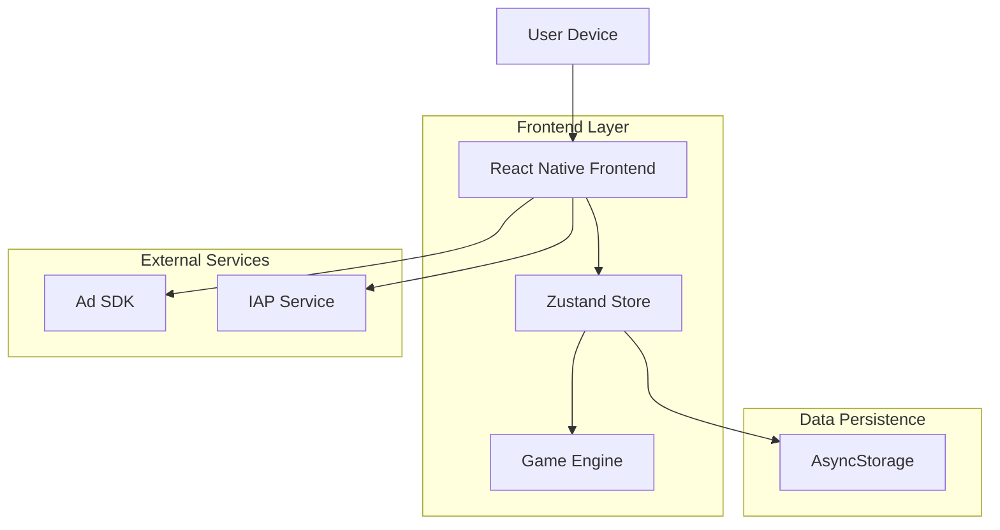
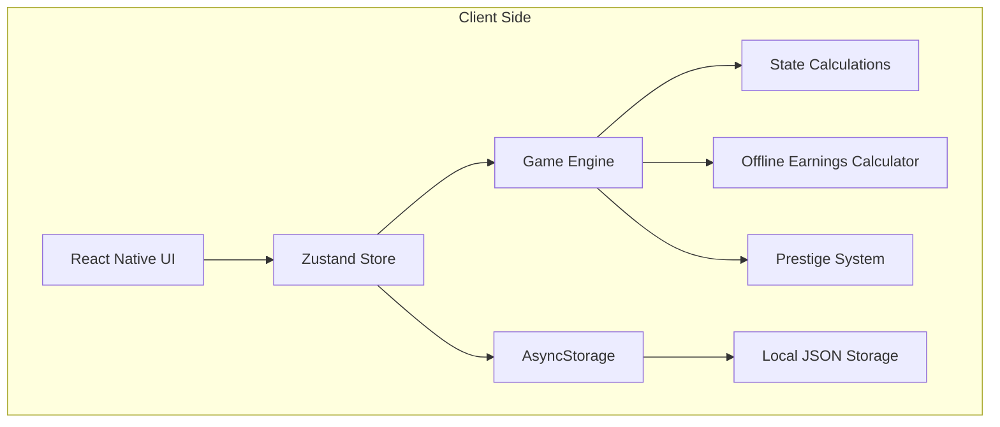
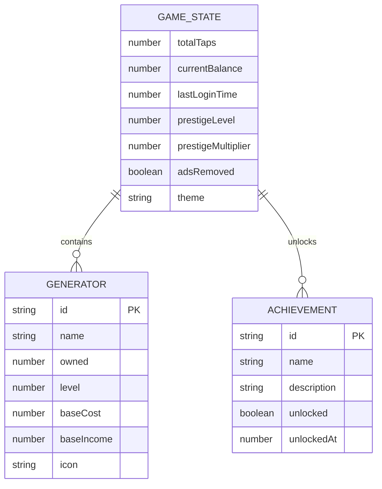

## 1. Architecture Design



## 2. Technology Description
- **Frontend**: React Native 0.73.9 + TypeScript 5.3.3 + React 18.2.0
- **State Management**: Zustand 4.4.7 for global game state
- **Navigation**: @react-navigation/bottom-tabs 6.5.11 for tab navigation
- **Animations**: react-native-reanimated 3.6.2 for smooth UI animations
- **Storage**: @react-native-async-storage/async-storage 1.21.0 for local data persistence
- **UI Components**: react-native-vector-icons 10.0.3 for icons
- **Initialization Tool**: React Native CLI (npx react-native init)

## 3. Route Definitions
| Route | Purpose |
|-------|---------|
| / | Main game screen with tap button and currency display |
| /generators | Generator purchase and management interface |
| /prestige | Prestige system and multiplier information |
| /settings | Game settings, themes, and achievements |

## 4. API Definitions

### 4.1 Storage API
```typescript
// Game state interface
interface GameState {
  totalTaps: number;
  currentBalance: number;
  lastLoginTime: number;
  prestigeLevel: number;
  prestigeMultiplier: number;
  generators: {
    [key: string]: {
      owned: number;
      level: number;
      baseCost: number;
      baseIncome: number;
    }
  };
  achievementsUnlocked: string[];
  adsRemoved: boolean;
  theme: 'dark' | 'light' | 'neon';
}

// Storage operations
const saveGameState = async (state: GameState): Promise<void>
const loadGameState = async (): Promise<GameState | null>
const clearGameState = async (): Promise<void>
```

### 4.2 Game Engine API
```typescript
// Game actions
interface GameActions {
  tap(): void;
  buyGenerator(generatorId: string): boolean;
  prestige(): boolean;
  calculateOfflineEarnings(): number;
  getPassiveIncomePerSecond(): number;
  canAffordGenerator(generatorId: string): boolean;
}

// Generator definitions
interface Generator {
  id: string;
  name: string;
  description: string;
  baseCost: number;
  baseIncome: number;
  icon: string;
}
```

## 5. Server Architecture Diagram

This is a client-side only application with no backend server required. All game logic runs locally on the device.



## 6. Data Model

### 6.1 Data Model Definition


### 6.2 Data Definition Language

```typescript
// Game state schema (stored as JSON in AsyncStorage)
interface GameStateSchema {
  // Core progression
  totalTaps: number;              // Lifetime taps earned
  currentBalance: number;           // Current spendable currency
  lastLoginTime: number;            // Unix timestamp
  
  // Prestige system
  prestigeLevel: number;            // Current prestige level
  prestigeMultiplier: number;       // Income multiplier
  
  // Generators
  generators: {
    autoClicker: GeneratorState;
    clickFarm: GeneratorState;
    robotWorker: GeneratorState;
    aiAssistant: GeneratorState;
    corporation: GeneratorState;
    planetMiner: GeneratorState;
    galaxyFarm: GeneratorState;
  };
  
  // Meta
  achievementsUnlocked: string[];
  adsRemoved: boolean;
  theme: 'dark' | 'light' | 'neon';
}

interface GeneratorState {
  owned: number;
  level: number;
  baseCost: number;
  baseIncome: number;
}

// Generator configuration
const GENERATORS: Generator[] = [
  {
    id: 'autoClicker',
    name: 'Auto Clicker',
    description: 'Automatically generates taps',
    baseCost: 10,
    baseIncome: 1,
    icon: 'touch-app'
  },
  {
    id: 'clickFarm',
    name: 'Click Farm',
    description: 'Multiple automated clickers',
    baseCost: 100,
    baseIncome: 5,
    icon: 'group-work'
  },
  {
    id: 'robotWorker',
    name: 'Robot Worker',
    description: 'Advanced robotic clicking',
    baseCost: 500,
    baseIncome: 25,
    icon: 'smart-toy'
  },
  {
    id: 'aiAssistant',
    name: 'AI Assistant',
    description: 'AI-powered tap generation',
    baseCost: 2500,
    baseIncome: 100,
    icon: 'psychology'
  },
  {
    id: 'corporation',
    name: 'Corporation',
    description: 'Large-scale tap production',
    baseCost: 15000,
    baseIncome: 500,
    icon: 'business'
  },
  {
    id: 'planetMiner',
    name: 'Planet Miner',
    description: 'Extract taps from planets',
    baseCost: 100000,
    baseIncome: 2500,
    icon: 'public'
  },
  {
    id: 'galaxyFarm',
    name: 'Galaxy Farm',
    description: 'Harness power of galaxies',
    baseCost: 1000000,
    baseIncome: 10000,
    icon: 'rocket-launch'
  }
];

// Prestige milestones
const PRESTIGE_MILESTONES = [
  { level: 1, requiredTaps: 1000000, multiplier: 2 },    // 1M taps
  { level: 2, requiredTaps: 100000000, multiplier: 3 },  // 100M taps
  { level: 3, requiredTaps: 10000000000, multiplier: 4 }, // 10B taps
  { level: 4, requiredTaps: 1000000000000, multiplier: 5 } // 1T taps
];
```

## 7. Component Architecture

```
src/
├── components/
│   ├── TapButton.tsx           # Main tap button with animations
│   ├── CurrencyDisplay.tsx     # Large animated number display
│   ├── GeneratorCard.tsx       # Individual generator purchase card
│   ├── PrestigeCard.tsx        # Prestige information and action
│   ├── AchievementBadge.tsx    # Achievement display component
│   └── ThemeProvider.tsx       # Theme context provider
├── screens/
│   ├── MainGameScreen.tsx      # Main game interface
│   ├── GeneratorsScreen.tsx    # Generator purchase screen
│   ├── PrestigeScreen.tsx      # Prestige system screen
│   └── SettingsScreen.tsx      # Settings and achievements
├── navigation/
│   └── AppNavigator.tsx        # Bottom tab navigation setup
├── store/
│   ├── gameStore.ts           # Zustand game state store
│   ├── gameActions.ts         # Game logic actions
│   └── gameSelectors.ts       # State selection utilities
├── services/
│   ├── storageService.ts      # AsyncStorage wrapper
│   ├── gameEngine.ts          # Core game calculations
│   └── offlineCalculator.ts   # Offline earnings calculator
├── hooks/
│   ├── useGameState.ts        # Game state hook
│   ├── useOfflineEarnings.ts  # Offline earnings calculation hook
│   └── usePassiveIncome.ts    # Passive income tracking hook
├── utils/
│   ├── numberFormatter.ts     # Large number formatting
│   ├── achievementChecker.ts  # Achievement logic
│   └── constants.ts           # Game constants
└── types/
    └── game.types.ts          # TypeScript type definitions
```

## 8. Performance Considerations

- **State Updates**: Batch state updates to prevent excessive re-renders
- **Number Formatting**: Use efficient formatting for large numbers (1K, 1M, 1B)
- **Animation Optimization**: Use native driver for animations where possible
- **Storage**: Save game state periodically, not on every tap
- **Memory Management**: Clear old animation references and prevent memory leaks

## 9. Security & Data Integrity

- **Local Storage**: Validate data integrity when loading from AsyncStorage
- **Cheating Prevention**: Implement basic checksum validation for save data
- **Data Recovery**: Provide data reset option if corruption detected
- **Backup System**: Allow manual export/import of game data